# AI slopped together mobile wallet. it's shit but it kinda works

An Android Wasabi Wallet experiment, kept here as a showcase. The phone experience
failed acceptance. The app was removed from the handset; its private data was
retained to avoid destroying a wallet.

The complete mobile implementation is preserved on `codex/android-mobile-showcase`.
It had already been committed to this fork's `master`; the showcase PR adds this
gallery and records the state of that experiment.

## Screenshots

These are unedited screenshots of the signed Release app, version **0.3.16 (21)**,
on an **Android API 35 / x86_64 emulator**. The wallet named **Native qualification**
is a disposable Bitcoin **regtest** fixture, including its balance, addresses and
transactions. The empty setup forms contain no recovery words or passwords.
No handset screenshots or personal wallet data are published.

<table>
  <tr><th>Wallets</th><th>Create wallet</th><th>Recover wallet</th></tr>
  <tr>
    <td>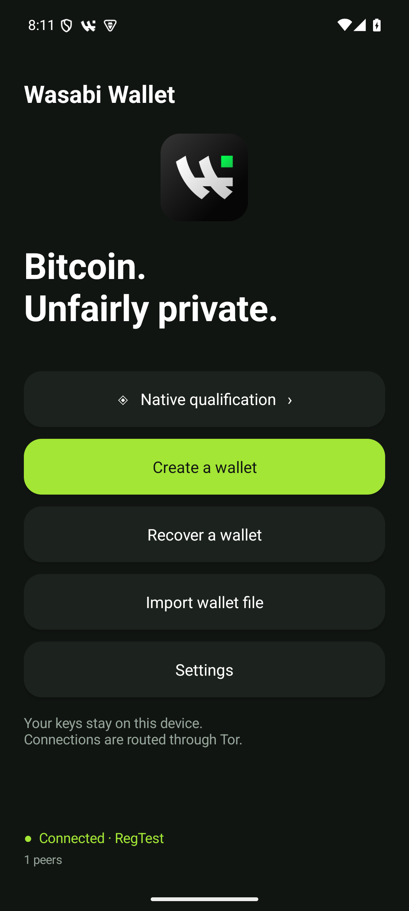</td>
    <td>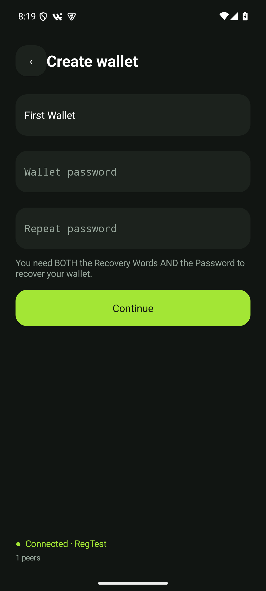</td>
    <td>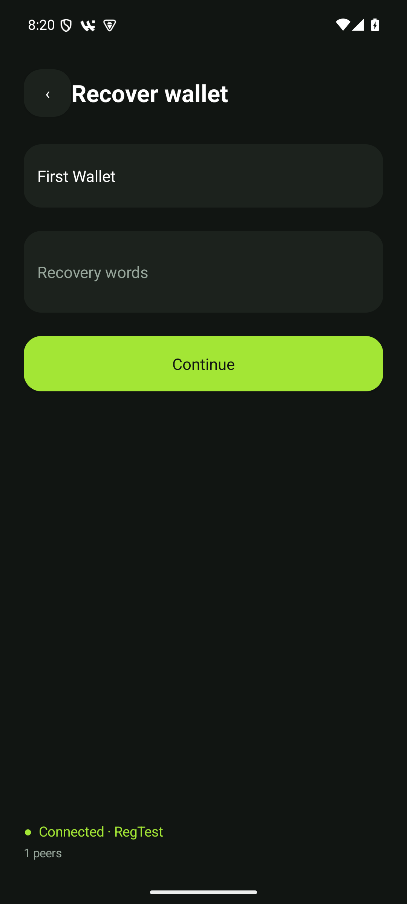</td>
  </tr>
  <tr><th>Wallet home</th><th>Receive</th><th>Transactions</th></tr>
  <tr>
    <td>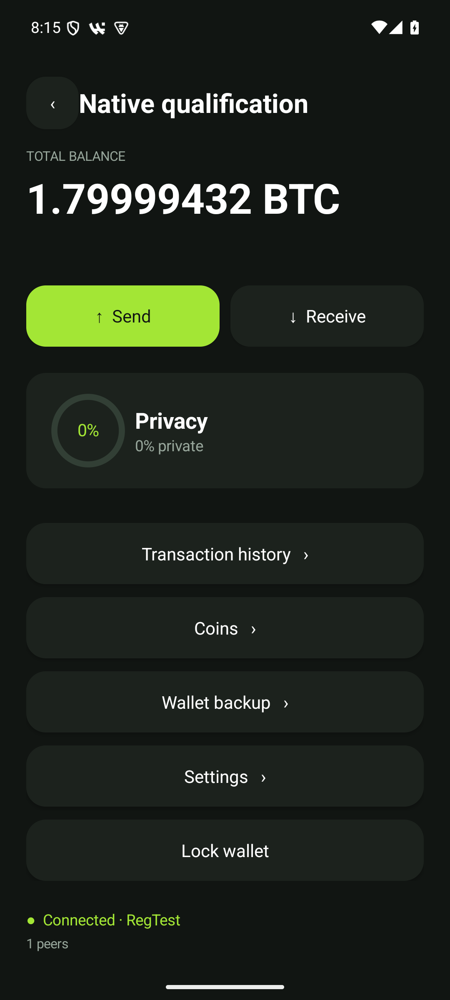</td>
    <td>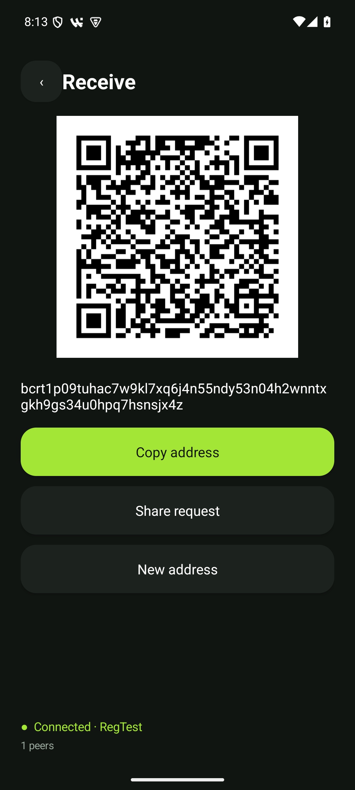</td>
    <td>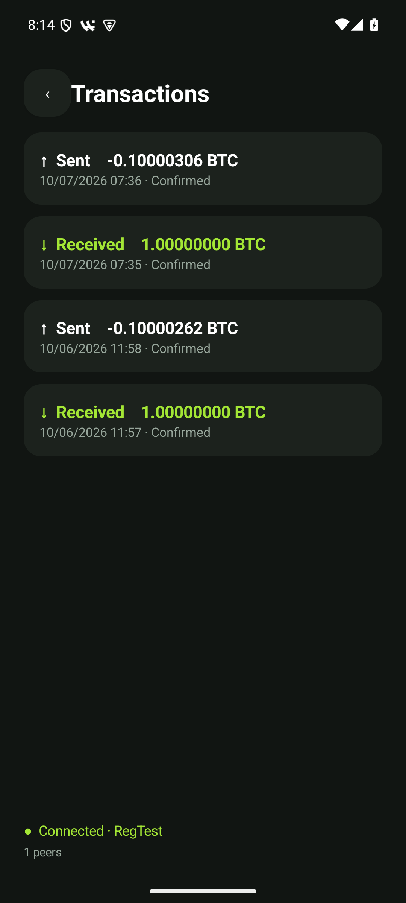</td>
  </tr>
  <tr><th>Coins</th><th>Send</th><th>Review</th></tr>
  <tr>
    <td>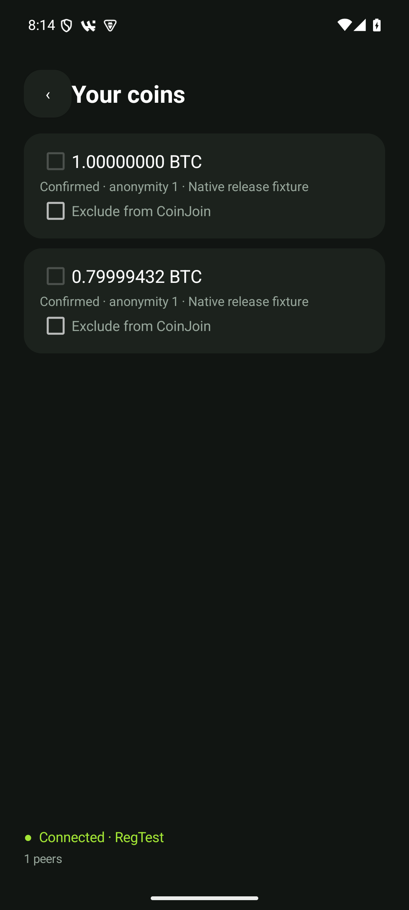</td>
    <td>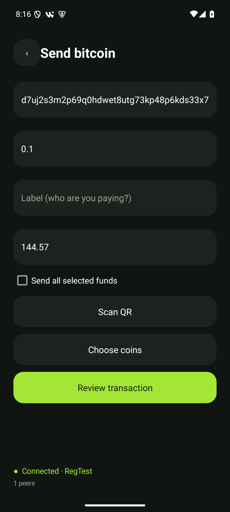</td>
    <td>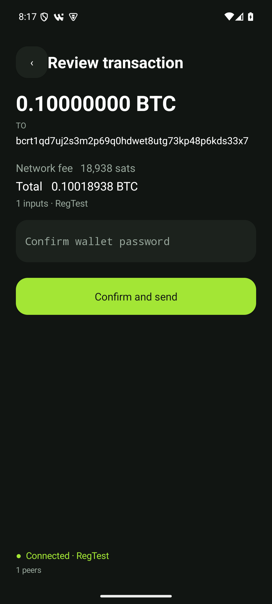</td>
  </tr>
  <tr><th>Privacy / CoinJoin</th><th>Settings</th><th>Wallet backup</th></tr>
  <tr>
    <td>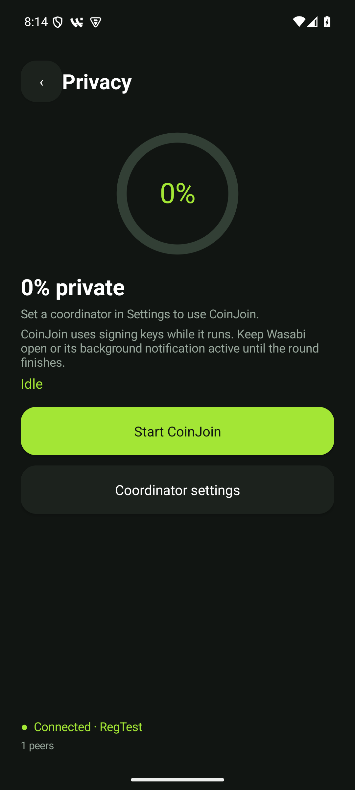</td>
    <td>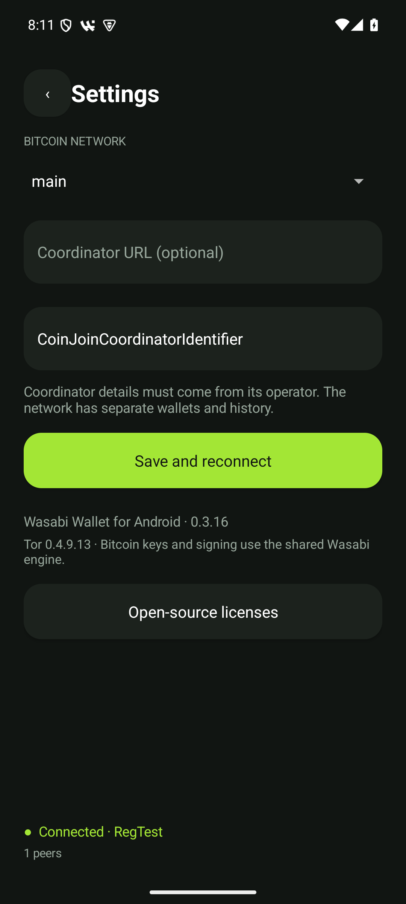</td>
    <td>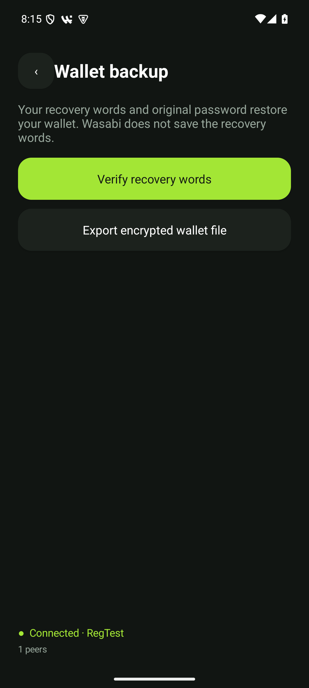</td>
  </tr>
</table>

## What is in the branch

- A native Android interface over the shared Wasabi Bitcoin and WabiSabi engine,
  using .NET 10 Android Mono.
- Creation, recovery, encrypted backup import/export, receive QR codes, send
  proposals, fees, coin selection, transaction history and replacement preparation.
- Tor transport, synchronization progress, lifecycle handling, Android Keystore
  storage, device authorization and optional CoinJoin controls.
- Android build tooling, native dependency recipes, runtime probes and synthetic
  regtest/CoinJoin qualification harnesses.

Start with [the Android app](../../../WalletWasabi.Android),
[the mobile session layer](../../../WalletWasabi.Mobile),
[mobile tests](../../../WalletWasabi.Mobile.Tests) and
[build instructions](../README.md).
The [implementation comparison](https://github.com/nopara73/WalletWasabi/compare/5e26b4f83a27b6d5e70d5db7fe68a7e1a3b5113c...53ccd2dc8782f9304b56239855df15e718f53b84)
includes the mobile code and the changes made to the shared engine.

## What passed, and what did not

The captured APK comes from
[`53ccd2dc`](https://github.com/nopara73/WalletWasabi/commit/53ccd2dc8782f9304b56239855df15e718f53b84).
[Android CI](https://github.com/nopara73/WalletWasabi/actions/runs/37583395208) and
[desktop CI](https://github.com/nopara73/WalletWasabi/actions/runs/37583395187)
passed for that source. Retained checks cover API 24/35/36, a verified 16 KB
emulator, funded regtest payments, recovery, updates, twenty fresh synthetic
CoinJoin rounds and deterministic interruption scenarios. The signed app's funded
UI checks passed on the retained API 35 emulator; a separate fresh emulator run
failed with app/system ANRs and was retained as a failure.

The release record remains **BLOCKED**, with **releaseReady: false**:

- The reported create/unlock failure on the actual handset has not been closed
  by a successful handset retest. The last fixes have emulator evidence.
- Physical biometric/device prompts and camera behavior remain unqualified.
- The selected production coordinator's `/wabisabi/status` request returned
  **HTTP 301 to `https://kruw.io`**, including through the packaged Tor transport.
  Synthetic CoinJoin success does not establish production coordinator operation.
- No authorized disposable-mainnet receive/send/confirmation test was completed.
- This work has not received an independent security audit, and the synthetic
  rounds do not establish real-world anonymity.

The screenshot [manifest](screenshots/manifest.json) pins the source, APK checksum
and individual image checksums. Detailed engineering records are described in
[validation](../VALIDATION.md), [source review](../SECURITY_REVIEW.md) and
[the unfinished phone handoff](../PHONE_HANDOFF.md).
